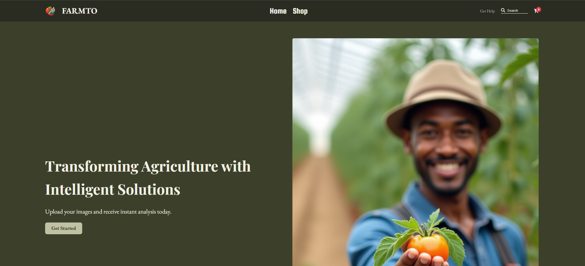
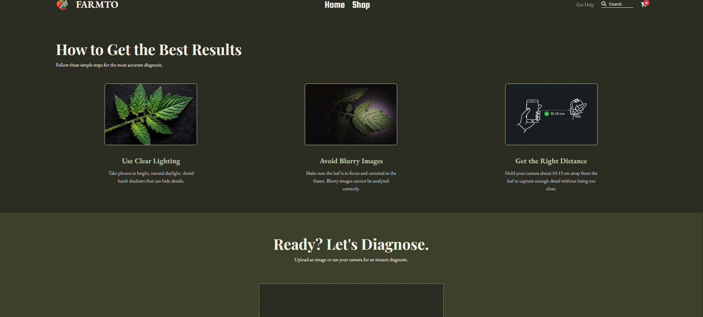
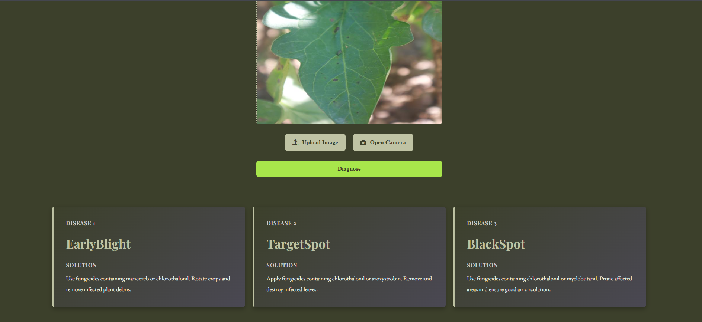
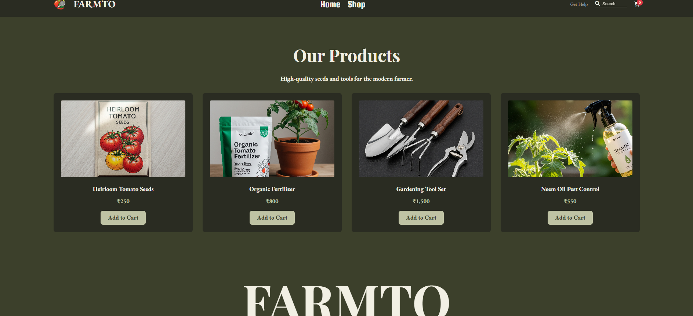

# Tomato-leaf-disease
# Farmto - Plant Disease Detection and Farming Assistance System

## Overview

Farmto is a Flask-based web application that helps farmers and plant enthusiasts identify plant diseases using deep learning-based image classification.

The system allows users to upload plant leaf images and receive disease predictions generated by a trained ResNet50 model.

In addition to disease detection, the platform provides:

* Agricultural assistance resources
* Farming-related product recommendations
* Informative blogs and educational content

---

## Features

### Plant Disease Detection

* Upload plant leaf images
* Deep learning-based disease prediction
* Confidence score visualization
* Image preprocessing and classification pipeline

### Farming Assistance

* Farming guidance resources
* Educational articles
* Plant care information

### Product Marketplace

* Browse farming-related products
* Shopping cart functionality
* Product management interface

---

## Tech Stack

### Backend

* Python
* Flask

### Machine Learning

* PyTorch
* TIMM
* ResNet50

### Frontend

* HTML5
* CSS3
* JavaScript

### Image Processing

* Pillow
* NumPy

---

## Project Structure

```text
Farmto/
├── app.py
├── utils.py
├── requirements.txt
├── templates/
├── static/
├── Model/
└── notebooks/
```

---

## Installation

### Clone Repository

```bash
git clone https://github.com/YOUR_USERNAME/Farmto.git
cd Farmto
```

### Create Virtual Environment

```bash
python -m venv .venv
```

### Activate Virtual Environment

Windows:

```bash
.venv\Scripts\activate
```

### Install Dependencies

```bash
pip install -r requirements.txt
```

### Run Application

```bash
python app.py
```

Open:

```text
http://127.0.0.1:5000
```

---

## Screenshots

## Homepage



## Disease Detection



## Prediction Result



## Shop Page



## Model Information

Model Architecture:

* ResNet50

Framework:

* PyTorch

Task:

* Plant Disease Classification

---

## Future Improvements

* More disease categories
* Real-time camera detection
* Mobile application
* Cloud deployment
* Multilingual support

---
# Team
This project was developed as a group academic project by:

- Hrudya Sudhees
- Gaayathri M
- Jenet Shirley J

Each team member contributed by developing and evaluating different deep learning models for plant disease classification.

MSc Data Science
Christ University